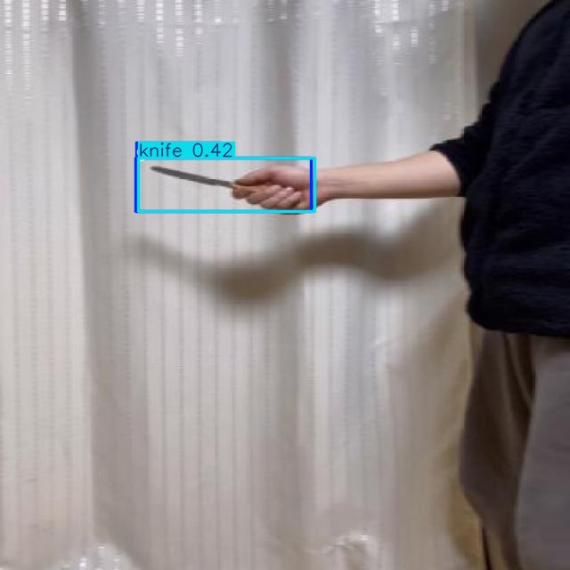
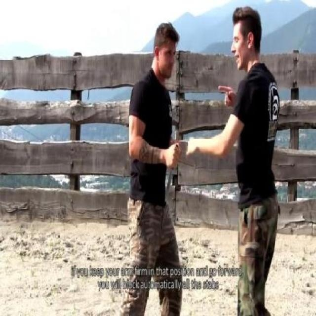

# Weapon Detection System using YOLOv8

A computer vision project that detects weapons (guns and knives) in images and videos using YOLOv8.

## Demo Results

### Gun Detection

### Knife Detection

## Project Overview
- **Model:** YOLOv8s (fine-tuned)
- **Classes:** Gun, Knife
- **Dataset:** 891 gun images + knife detection dataset
- **Training:** 30 epochs, 640x640 image size
- **mAP50:** 0.475
- **Recall:** 0.87
- **Inference Speed:** ~16ms per image (Tesla T4 GPU)

## Tech Stack
- Python 3.10
- YOLOv8 (Ultralytics)
- OpenCV
- PyTorch
- Google Colab (T4 GPU)

## Model Performance
| Metric | Value |
|--------|-------|
| mAP50 | 0.475 |
| mAP50-95 | 0.298 |
| Precision | 0.48 |
| Recall | 0.87 |
| Inference Speed | ~16ms |

## Future Improvements
- Train for more epochs (100+)
- Add more diverse training data
- Implement real-time video detection
- Deploy as web application using FastAPI
